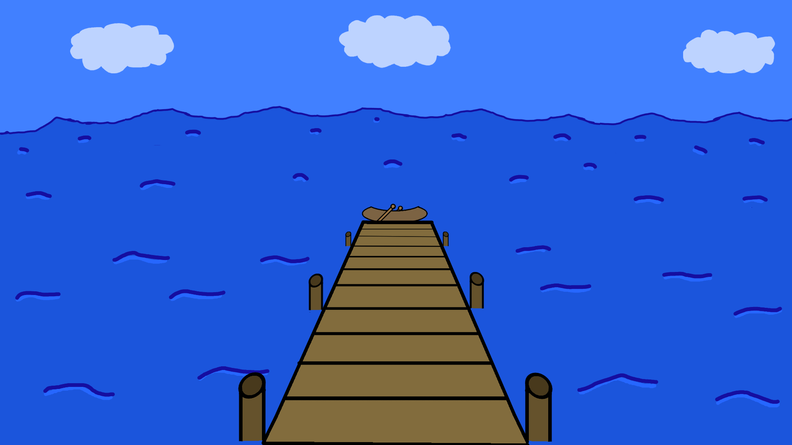

# Fish Away

## Description

Fish Away is a 2D fishing simulator prototype made in Unity.
The player has two minutes to catch as many fish as
they can. Fish come in rarities and some are worth
more than others.

## Controls

A and D to move left and right.

Space to lower the fishing line.

ESC to pause the game.

## Showcase

## Credits

Memoraphile @ You're Perfect Studio

Soft Game Theme Loop.wav by Mrthenoronha -- <https://freesound.org/s/521656/>
-- License: Attribution NonCommercial 4.0

Calm & relaxing music #2 by BloodPixelHero -- <https://freesound.org/s/636255/>
-- License: Attribution 4.0
